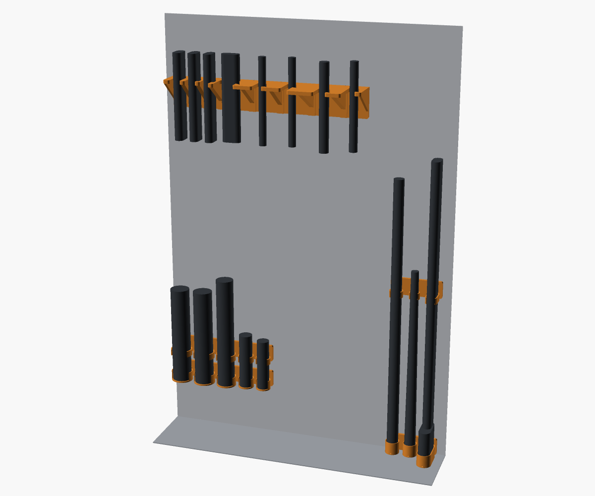

# Hamstra

Parametric, 3D printable organizers for guns and hunting gear, written in
OpenSCAD. The first set lives in the gun safe and holds on with neodymium
magnets, so nothing is drilled into the safe:

- Suppressor holder: a cradle row the suppressors stand in and a clip row
  above it that they snap into, two short prints
- Spare barrel holder: a base row of cups standing on the safe floor, and
  a separate snap clip for each barrel just below its muzzle. Round
  barrels and over and under barrel sets can share one base row. A
  groove in each cup floor runs out the front, so moisture drains and
  air reaches the breech.
- Gun rack: a comb shelf for the top of the safe



Every slot is configured on its own: diameter, distance from the safe
wall and gap to its neighbour. Three break action shotguns can sit tight
to the wall and close together while a scoped bolt action next to them
sits further out with more room.

Every row can also print as separate modules, one per slot, that slide
together with a dovetail like building blocks: smaller prints, and a
slot can be swapped for a different one later.

Reloading equipment and other gear will follow.

Status: early prototypes. Dimensions are still being tuned.

## Models

| Model | File | Prints |
| --- | --- | --- |
| Suppressor holder (cradle and clip) | `cad/safe/suppressor_holder.scad` | upright, as modeled |
| Barrel holder (cup and clip) | `cad/safe/barrel_holder.scad` | upright, as modeled |
| Gun rack | `cad/safe/gun_rack.scad` | shelf down, as modeled |
| Magnet pocket gauge | `cad/calibration/magnet_pocket_gauge.scad` | as modeled |
| Dovetail gauge | `cad/calibration/dovetail_gauge.scad` | as modeled |
| Fit gauge (rings and rack slots) | `cad/calibration/fit_gauge.scad` | flat, as modeled |

None of them need support.

## Customizing

Open a model in OpenSCAD and use the Customizer (Window, Customizer). Every
model lists its knobs there: item diameters, heights, magnet rows and
columns. Measure your suppressor, barrel or breech with calipers and type
the measured diameter in; the models add the clearance themselves.

Per-slot knobs are lists with one entry per slot, and the number of
diameters sets the number of slots:

```
suppressor_d = [50, 44];   // two slots
wall_offset  = [0, 15];    // the second sits 15 mm further from the wall
gaps         = [12];       // 12 mm between them
```

A single number applies to every slot, and a short list repeats its last
entry. The Customizer edits lists of up to four numbers; for more slots
edit the file.

The barrel holder prints as two parts from one file, picked with the
`part` dropdown: the cup and the clip share the slot layout, so each
barrel stands plumb.

## Modular rows

Set `modular = true` and the row prints as one module per slot, each
with its own magnets. Neighbours join with a sliding dovetail on the
plate edges between slots; the outer ends of the row stay plain. Slide
each module down onto the tongue of the one to its left until it stops,
which leaves them level. The gun rack prints upside down, so its joint
is the other way round: mount the rack from the right, and drop each
module's tongue down into the slot of the one to its right.
`scripts/regen_all.py` writes every module to its own STL, numbered
from the left (`gun_rack_modular_1.stl`, ...). With `print_slot = 0` all
modules are laid out side by side for one print; `print_slot = 2` gives
just the second, for reprinting or swapping one slot. `magnets_x` then
counts columns per module.

Print `dovetail_gauge` first and set `dovetail_clearance` to the
tightest slot the key slides into by hand without wobble.

### Your own builds

To keep your own setup, add a small wrapper file that uses a model and
passes your measurements, like `cad/my_safe/suppressors.scad`. Wrapper
files can change the number of slots; OpenSCAD's saved Customizer
presets cannot, because they must keep the list lengths of the model's
defaults. `scripts/regen_all.py` builds wrapper files like any model.

A few values are shared by every model and live in
`cad/design_params.scad` instead: the magnet size and pocket fit, the
back plate thickness and the dovetail joint.

## Fitting your own gear

Before printing a full holder, print `fit_gauge`: thin slices of the real
holder geometry, a few grams each.

- `part = rings`: snap clip rings in a grid, columns stepping the
  clearance and rows stepping the snap opening. Set `ring_d` to the
  measured diameter and press the item into each ring; use the winning
  clearance and snap in the holder. A snap of 1 is a closed ring and
  tests the cup and cradle fit.
- `part = slots`: a slice of the gun rack comb with one slot per width.
  Drop each gun's muzzle end in to pick its `slot_w`.

Double guns fit the rack with per-slot widths. A side by side needs a
slot about as wide as both barrels together at the shelf height (often
around 40 mm for a 12 gauge); an over and under needs a slot about one
barrel wide, and stands with the barrels stacked front to back in the
slot. Try both on the slot gauge first.

## Magnets

The defaults use 12x5 mm neodymium disc magnets. Change `magnet_d` and
`magnet_h` in `cad/design_params.scad` for other sizes.

1. Print `magnet_pocket_gauge` first, press a magnet into each pocket and
   set `magnet_clearance` to the tightest one that seats fully.
2. Put a drop of epoxy or CA in each pocket and press the magnet in
   until it stops on the skin at the bottom. With a friction pad it then
   stands `pad_t - pad_air` out of the back (0.7 mm by default).
3. A magnet holds far less sideways on a vertical wall than its rated
   pull, about a quarter: roughly 0.8 kg for a 12x5 magnet on bare
   steel. The defaults give the rows that carry weight (the suppressor
   cradle) about twice the margin they need, and two magnets to rows
   that stand on the floor or only keep items in place. A felt or
   carpet lined safe wall weakens the hold; add magnets there.
4. `python3 scripts/count_magnets.py` counts the magnets your builds
   need.

### Friction pad

A smooth steel wall lets a bare plate slide. Every model has a friction
pad that goes between its back plate and the wall: set `pad = true` in
the Customizer (regen_all exports it as `..._pad.stl`). Either print it
flat in TPU, or print it (or a paper outline of it) as a template and
cut silicone sheet to match. Set `pad_t` in `cad/design_params.scad` to
the pad's thickness before printing the parts: the magnet pockets get
shallower so each magnet reaches through its hole in the pad and stops
`pad_air` short of the wall. The pad takes the friction, the magnets
pull through nothing but air, and the magnets hold the pad in place, so
it needs no glue. Silicone squeezes under the pull more than TPU; give
it a bit more `pad_air`. `pad_t = 0` builds plates with flush magnets
and no pad.

The barrel holder's cup row stands on the safe floor, so its pad output
holds a second piece: a base pad cut to the row's footprint, which goes
under it. It keeps the row from sliding on the floor and lifts the cups
a little off it. No magnet holds it, so the printed TPU version has a
low lip the row sits in (`base_rim_h`). For silicone, use self-adhesive
sheet under the row. `base_pad = false` leaves it out.

## Working on the design

Everything is driven from one script:

```bash
python3 scripts/regen_all.py           # gates, every STL, the assembly image
python3 scripts/regen_all.py --check   # read-only gate, what CI runs
```

It fetches OpenSCAD through nix. Without nix, point `OPENSCAD` at your own
binary. The scripts are standard library Python.

## License

MIT, see `LICENSE`.
